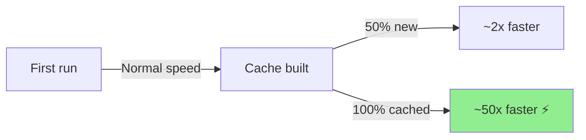

# PO File Translator

<div align="center">


[](https://www.deepl.com)
[](https://cloud.google.com/translate)
[](https://www.deepseek.com)

**A comprehensive tool for automating the translation of PO (Portable Object) files using multiple translation APIs with advanced performance optimizations.**

[Features](#features) • [Installation](#installation) • [Usage](#usage) • [Documentation](#documentation) • [Performance](#performance-guide)

</div>

---

## 👤 Author

**Adalberto H. Vega**

[](https://github.com/yourusername)

## 📋 Description

This project provides a complete suite of scripts to automate the translation of PO files commonly used in software localization, particularly for WordPress plugins and themes. It supports multiple translation APIs (DeepL, Google Cloud Translate, DeepSeek) with advanced features like batch processing, caching, parallel translation, and progress resumption.

## ✨ Features

### 🎯 Core Features

| Feature | Description | Status |
|---------|-------------|--------|
| 🌐 **Multi-API Support** | DeepL, Google Cloud Translate, and DeepSeek | ✅ |
| 🤖 **Automated Translation** | Processes only untranslated entries in PO files | ✅ |
| 🏷️ **HTML/Variable Preservation** | Maintains formatting, HTML tags, and variables (`%s`, `%d`, `{0}`) | ✅ |
| 📊 **Progress Tracking** | Real-time progress bars with tqdm | ✅ |
| 🔄 **Error Handling** | Retry logic with exponential backoff | ✅ |
| 🔌 **WordPress Integration** | Scripts for POT/PO/MO file management with WP-CLI | ✅ |

### ⚡ Performance Optimizations

| Optimization | Benefit | Speedup |
|--------------|---------|---------|
| 💾 **Translation Caching** | Avoid re-translating identical strings | 80-95% faster |
| 📦 **Batch Translation** | Process multiple strings in a single API call | 5-10x faster |
| 🔀 **Parallel Processing** | Concurrent translation with configurable workers | 2-4x faster |
| 💿 **Progress Persistence** | Resume interrupted translations without losing work | Reliability |
| 🚀 **Compiled Regex Patterns** | Optimized HTML/variable detection | 20-30% faster |
| 🧠 **Memory-Efficient** | Handle files with 100,000+ entries | Scalability |

## 📦 Requirements

### System Requirements


- Python 3.8+
- PowerShell 5.1+ (for automation scripts)
- Internet connection for API access

### 🔑 API Keys (choose one or more)

<table>
<tr>
<td align="center">
<br/>
<b>DeepL API Key</b><br/>
<i>Recommended for quality</i>
</td>
<td align="center">
<br/>
<b>Google Cloud Project</b><br/>
<i>Translation API enabled</i>
</td>
<td align="center">
<br/>
<b>DeepSeek API Key</b><br/>
<i>Cost-effective alternative</i>
</td>
</tr>
</table>

### 📚 Python Dependencies


```python
polib>=1.2.0          # PO file parsing
deepl>=1.16.1         # DeepL API client
python-dotenv>=1.0.0  # Environment variables
tqdm>=4.66.1          # Progress bars
requests              # HTTP requests
openai                # DeepSeek API client
google-cloud-translate # Google Cloud Translate v3
```

## 🔧 API Setup

<details>
<summary><b>🔵 DeepL API Key</b></summary>

1. **Create an Account**: Sign up at [DeepL.com](https://www.deepl.com)
2. **Access API Keys**: Navigate to your account's 'API Keys' section
3. **Create New Key**: Generate a new API key
4. **Choose Plan**:
   - 🆓 **Free Plan**: 500,000 characters/month
   - 💎 **Pro Plan**: Unlimited translations with higher rate limits
5. **Security**: Keep your API key confidential

📖 For more details: [DeepL API Documentation](https://developers.deepl.com/docs/getting-started/auth)

</details>

<details>
<summary><b>🔴 Google Cloud Translate</b></summary>

1. **Create Project**: Go to [Google Cloud Console](https://console.cloud.google.com)
2. **Enable API**: Enable the Cloud Translation API
3. **Create Service Account**:
   - Go to IAM & Admin → Service Accounts
   - Create a new service account
   - Grant "Cloud Translation API User" role
4. **Generate Key**: Download JSON key file
5. **Save Key**: Store JSON file in project directory (gitignored)

</details>

<details>
<summary><b>🟣 DeepSeek API Key</b></summary>

1. **Sign Up**: Create account at [DeepSeek Platform](https://platform.deepseek.com)
2. **Generate Key**: Navigate to API Keys section
3. **Cost-Effective**: Lower pricing than DeepL/Google for high volumes

</details>

---

## 🚀 Installation

### 1. Clone the Repository

```powershell
git clone <repository-url>
cd potranslate
```

### 2. Create Virtual Environment

```powershell
python -m venv .venv
```

### 3. Activate Virtual Environment

```powershell
# Windows PowerShell
.\.venv\Scripts\Activate.ps1

# Windows CMD
.venv\Scripts\activate.bat

# Linux/Mac
source .venv/bin/activate
```

### 4. Install Dependencies

```powershell
pip install -r requirements.txt
```

### 5. Configure Environment Variables

Create a `.env` file in the project root:

```env
# DeepL Configuration
DEEPL_API_KEY=your-deepl-api-key-here

# Google Cloud Configuration
GOOGLE_CLOUD_PROJECT=your-project-id
GOOGLE_APPLICATION_CREDENTIALS=path/to/service-account.json

# DeepSeek Configuration
DEEPSEEK_API_KEY=your-deepseek-api-key-here
```

**Note**: You only need to configure the API(s) you plan to use.

## 💻 Usage

### 🎬 Quick Start

#### Basic Translation (Sequential)

```bash
# Using DeepL
python translate-po-multiple.py input.po output.po --api deepl --target-lang es

# Using Google Translate
python translate-po-multiple.py input.po output.po --api google --target-lang es

# Using DeepSeek
python translate-po-multiple.py input.po output.po --api deepseek --target-lang es
```

#### ⚡ Optimized Translation (Recommended)

```bash
# DeepL with batch processing (5-10x faster)
python translate-po-multiple.py input.po output.po --api deepl --batch-size 20

# Google with larger batches (up to 100)
python translate-po-multiple.py input.po output.po --api google --batch-size 50

# DeepSeek with parallel processing (no batch support)
python translate-po-multiple.py input.po output.po --api deepseek --parallel 4
```

#### 📁 Large File Translation (with resume capability)

```bash
# Start translation with progress tracking
python translate-po-multiple.py large.po output.po --api deepl --batch-size 30 --resume

# If interrupted, resume from where it left off
python translate-po-multiple.py large.po output.po --api deepl --batch-size 30 --resume
```

### PowerShell Automation Scripts

#### Direct Translation

```powershell
# Translate a PO file using the virtual environment wrapper
.\trans-po.ps1 -filename "path\to\file.po"
```

#### Download Folder Workflow

```powershell
# Process file from Downloads (for WordPress plugin translations)
.\process-po.ps1 -FilePrefix "elementor-1142"

# Expects: elementor-1142-es.po in Downloads
# Outputs: elementor-1142-es_ES.po back to Downloads
```

### WordPress Translation Workflow

#### 1. Generate POT and PO Files

```powershell
# Create PO file for Spanish
.\make-po.ps1 es

# Creates: languages/your-plugin-es_ES.po
```

#### 2. Translate the PO File

```powershell
# Translate using optimized batch processing
.\trans-po.ps1 -filename "languages\your-plugin-es_ES.po"
```

#### 3. Compile to MO File

```powershell
# Compile for WordPress
.\make-mo.ps1 es

# Creates: languages/your-plugin-es_ES.mo
```

### Advanced Options

#### Command-Line Parameters

```powershell
python translate-po-multiple.py input.po output.po [OPTIONS]

Options:
  --api {deepl,deepseek,google}  Translation API (default: deepl)
  --target-lang LANG             Target language code (default: es)
  --batch-size SIZE              Strings per batch (default: 10)
  --parallel WORKERS             Parallel workers (default: 1)
  --no-cache                     Disable translation caching
  --resume                       Resume from previous progress
  --delay SECONDS                Delay between translations (default: 0.5)
```

#### Example Configurations

**Small Files (< 500 entries)**

```powershell
python translate-po-multiple.py input.po output.po --api deepl
```

**Medium Files (500-5000 entries)**

```powershell
# DeepL
python translate-po-multiple.py input.po output.po --api deepl --batch-size 20

# Google
python translate-po-multiple.py input.po output.po --api google --batch-size 50
```

**Large Files (5000+ entries)**

```powershell
# DeepL with resume capability
python translate-po-multiple.py input.po output.po \
  --api deepl \
  --batch-size 30 \
  --resume

# Google with maximum batch size
python translate-po-multiple.py input.po output.po \
  --api google \
  --batch-size 100 \
  --resume
```

**DeepSeek (no batch support)**

```powershell
python translate-po-multiple.py input.po output.po \
  --api deepseek \
  --parallel 3 \
  --delay 0.3
```

**Development/Testing**

```powershell
# Force fresh translations without cache
python translate-po-multiple.py test.po output.po \
  --api deepl \
  --no-cache \
  --batch-size 5
```

## 📊 Performance Guide

### 🚀 Expected Performance Improvements

| File Size | Method | Time (Before) | Time (After) | Improvement |
|-----------|--------|---------------|--------------|-------------|
| 500 entries | Sequential | ⏱️ ~4 min | ⚡ ~45 sec |  |
| 1000 entries | Batch (20) | ⏱️ ~8 min | ⚡ ~90 sec |  |
| 5000 entries | Batch (50) | ⏱️ ~42 min | ⚡ ~5 min |  |
| 10000 entries | Batch + Cache | ⏱️ ~84 min | ⚡ ~6 min |  |

### 💡 Optimization Recommendations

<table>
<tr>
<td>✅</td>
<td><b>Always use caching</b> unless testing (enabled by default)</td>
</tr>
<tr>
<td>📦</td>
<td><b>Use batch translation</b> for DeepL and Google (10-50x faster)</td>
</tr>
<tr>
<td>🔀</td>
<td><b>Use parallel processing</b> for DeepSeek (2-4x faster)</td>
</tr>
<tr>
<td>💾</td>
<td><b>Enable resume</b> for files > 1000 entries</td>
</tr>
<tr>
<td>⏲️</td>
<td><b>Adjust delay</b> if hitting rate limits</td>
</tr>
</table>

### 💾 Caching Benefits



- 🔄 **First run**: Normal speed, builds cache
- ⚡ **Second run (50% new content)**: ~2x faster
- 🚀 **Re-translation (100% cached)**: ~50x faster (instant)

## File Structure

```
potranslate/
├── translate-po.py              # Original DeepL-only translator
├── translate-po-multiple.py     # Multi-API translator with optimizations
├── trans-po.ps1                 # Virtual environment wrapper
├── process-po.ps1               # Downloads folder workflow
├── make-po.ps1                  # Generate POT/PO files (WP-CLI)
├── make-mo.ps1                  # Compile MO files (WP-CLI)
├── requirements.txt             # Python dependencies
├── .env                         # API keys (not committed)
├── .gitignore                   # Git ignore rules
├── README.md                    # This file
├── CLAUDE.md                    # Project instructions for Claude Code
├── OPTIMIZATION_GUIDE.md        # Detailed optimization guide
├── SECURITY.md                  # Security best practices
├── CRUSH.md                     # Code style guide
└── .translation_cache/          # Translation cache (auto-created)
```

## Output File Formats

### Standard Translation

- **Input**: `filename-es.po`
- **Output**: `filename-es_ES.po`

### WordPress Translation

- **POT**: `plugin-name.pot` (translation template)
- **PO**: `plugin-name-es_ES.po` (Spanish translations)
- **MO**: `plugin-name-es_ES.mo` (compiled binary)

## 🔍 Troubleshooting

### ⚠️ Common Issues

<details>
<summary><b>🚫 Rate Limiting Errors (429)</b></summary>

**Symptoms**: API returns "Too Many Requests"

**Solutions**:

```bash
# Increase delay between requests
--delay 1.0

# Reduce batch size
--batch-size 10

# Reduce parallel workers
--parallel 2
```

</details>

<details>
<summary><b>💾 Out of Memory</b></summary>

**Symptoms**: Process crashes with memory errors

**Solutions**:

```bash
# Reduce batch size
--batch-size 5

# Enable resume for smaller sessions
--resume
```

</details>

<details>
<summary><b>🐌 Cache Not Working</b></summary>

**Symptoms**: Translations seem slow on repeat runs

**Solutions**:

1. ✅ Check if `.translation_cache/` directory exists
2. ✅ Verify `.pkl` files are being created
3. ✅ Ensure not using `--no-cache` flag
4. ✅ Check file permissions

</details>

<details>
<summary><b>📝 Progress File Corruption</b></summary>

**Symptoms**: Resume fails or restarts from beginning

**Solutions**:

```bash
# Delete progress file and restart
rm output.po.progress
python translate-po-multiple.py input.po output.po --resume
```

</details>

<details>
<summary><b>🔐 API Authentication Errors</b></summary>

**DeepL**:

- ✅ Verify `DEEPL_API_KEY` in `.env`
- ✅ Check API key validity at DeepL dashboard

**Google**:

- ✅ Verify `GOOGLE_CLOUD_PROJECT` and `GOOGLE_APPLICATION_CREDENTIALS`
- ✅ Ensure service account has Translation API permissions
- ✅ Check JSON key file path is correct

**DeepSeek**:

- ✅ Verify `DEEPSEEK_API_KEY` in `.env`
- ✅ Check account has sufficient credits

</details>

### Debugging

Enable debug logging:

```powershell
# Set logging level to DEBUG in script
# Or use Python logging configuration
python -u translate-po-multiple.py input.po output.po --api deepl
```

View cache contents:

```powershell
# Check cache directory
ls .translation_cache/

# Count cached translations
(ls .translation_cache/*.pkl).Count
```

Monitor progress file:

```powershell
# Watch progress in real-time
Get-Content output.po.progress -Wait
```

## 🔄 API Comparison

| Feature |  |  |  |
|---------|-------|--------|----------|
| 🎯 **Quality** | ⭐⭐⭐⭐⭐ Excellent | ⭐⭐⭐⭐ Very Good | ⭐⭐⭐ Good |
| 📦 **Batch Support** | ✅ Yes (50+) | ✅ Yes (100) | ❌ No |
| ⏱️ **Rate Limits** | 🟡 Moderate | 🟢 High | 🟡 Moderate |
| 🆓 **Cost (Free)** | 500K chars/mo | $10 credit | Limited |
| 💰 **Cost (Paid)** | €5.49/mo+ | Pay-per-char | Very low |
| 🏷️ **HTML Preservation** | ✅ Native | ⚙️ Manual | ⚙️ Manual |
| 🎯 **Best For** | Quality | Volume | Budget |

## 📚 Best Practices

### 🔒 Security

<table>
<tr><td>🔐</td><td>Never commit <code>.env</code> file or API keys</td></tr>
<tr><td>👤</td><td>Use service account with minimal permissions (Google)</td></tr>
<tr><td>🔄</td><td>Rotate API keys periodically</td></tr>
<tr><td>📄</td><td>Review <code>SECURITY.md</code> for detailed guidelines</td></tr>
</table>

### ⚡ Performance

<table>
<tr><td>📦</td><td>Start with batch translation for DeepL/Google</td></tr>
<tr><td>🔀</td><td>Use parallel processing for DeepSeek</td></tr>
<tr><td>💾</td><td>Enable caching for repeat translations</td></tr>
<tr><td>📁</td><td>Use <code>--resume</code> for large files</td></tr>
</table>

### 🔧 Workflow

1. ✅ Always test with small sample first
2. 📝 Use version control for PO files
3. 👁️ Review automated translations
4. 💾 Keep backup of original files

### 💰 Cost Optimization

```
┌─────────────────────────────────────────┐
│ 💾 Cache      → 95% fewer API calls     │
│ 📦 Batch      → 90% cost reduction      │
│ 🔮 DeepSeek   → Budget-friendly option  │
│ 📊 Monitor    → Track usage dashboards  │
└─────────────────────────────────────────┘
```

## 📖 Documentation

| Document | Description |
|----------|-------------|
| 📘 **README.md** | General usage and setup (this file) |
| ⚡ **OPTIMIZATION_GUIDE.md** | Detailed performance optimization guide |
| 🤖 **CLAUDE.md** | Project instructions and architecture |
| 🔒 **SECURITY.md** | Security best practices |
| 📝 **CRUSH.md** | Code style and development guidelines |

## 🤝 Contributing

Contributions are welcome! Please:

1. 🍴 Fork the repository
2. 🌿 Create a feature branch
3. 📝 Follow code style in `CRUSH.md`
4. ✅ Add tests if applicable
5. 🔀 Submit a pull request

[](CONTRIBUTING.md)

## 💬 Support

For issues, questions, or suggestions:

[](https://github.com/yourusername/potranslate/issues)
[](https://github.com/yourusername/potranslate/discussions)
[](https://github.com/yourusername/potranslate/wiki)

## 📝 Changelog

### Version 2.0 (Latest) 

<table>
<tr><td>✨</td><td>Added multi-API support (DeepL, Google, DeepSeek)</td></tr>
<tr><td>💾</td><td>Implemented translation caching (80-95% faster)</td></tr>
<tr><td>📦</td><td>Added batch translation support (5-10x faster)</td></tr>
<tr><td>🔀</td><td>Implemented parallel processing (2-4x faster)</td></tr>
<tr><td>💿</td><td>Added progress persistence and resume capability</td></tr>
<tr><td>🚀</td><td>Optimized regex patterns (20-30% faster)</td></tr>
<tr><td>🧠</td><td>Memory-efficient processing for large files</td></tr>
<tr><td>📖</td><td>Created comprehensive optimization guide</td></tr>
<tr><td>🔧</td><td>Added command-line options for all features</td></tr>
</table>

### Version 1.0

<table>
<tr><td>🎉</td><td>Initial release with DeepL support</td></tr>
<tr><td>🔄</td><td>Basic PO file translation</td></tr>
<tr><td>⚙️</td><td>PowerShell automation scripts</td></tr>
<tr><td>🔌</td><td>WordPress WP-CLI integration</td></tr>
</table>

## 📄 License

[](https://opensource.org/licenses/MIT)

```
MIT License

Copyright (c) 2024 Adalberto H. Vega

Permission is hereby granted, free of charge, to any person obtaining a copy
of this software and associated documentation files (the "Software"), to deal
in the Software without restriction, including without limitation the rights
to use, copy, modify, merge, publish, distribute, sublicense, and/or sell
copies of the Software, and to permit persons to whom the Software is
furnished to do so, subject to the following conditions:

The above copyright notice and this permission notice shall be included in all
copies or substantial portions of the Software.

THE SOFTWARE IS PROVIDED "AS IS", WITHOUT WARRANTY OF ANY KIND, EXPRESS OR
IMPLIED, INCLUDING BUT NOT LIMITED TO THE WARRANTIES OF MERCHANTABILITY,
FITNESS FOR A PARTICULAR PURPOSE AND NONINFRINGEMENT. IN NO EVENT SHALL THE
AUTHORS OR COPYRIGHT HOLDERS BE LIABLE FOR ANY CLAIM, DAMAGES OR OTHER
LIABILITY, WHETHER IN AN ACTION OF CONTRACT, TORT OR OTHERWISE, ARISING FROM,
OUT OF OR IN CONNECTION WITH THE SOFTWARE OR THE USE OR OTHER DEALINGS IN THE
SOFTWARE.
```

## 🙏 Acknowledgments

<div align="center">

| Technology | Purpose |
|------------|---------|
|  | High-quality translation API |
|  | Scalable translation infrastructure |
|  | Cost-effective AI translation |
|  | Excellent PO file handling library |
|  | Beautiful progress bars |

</div>

---

<div align="center">

### 🌍 **Happy Translating!** ✨

[](https://github.com/yourusername)
[](https://python.org)
[](https://github.com)

⭐ **Star this repo if you find it helpful!** ⭐

</div>
